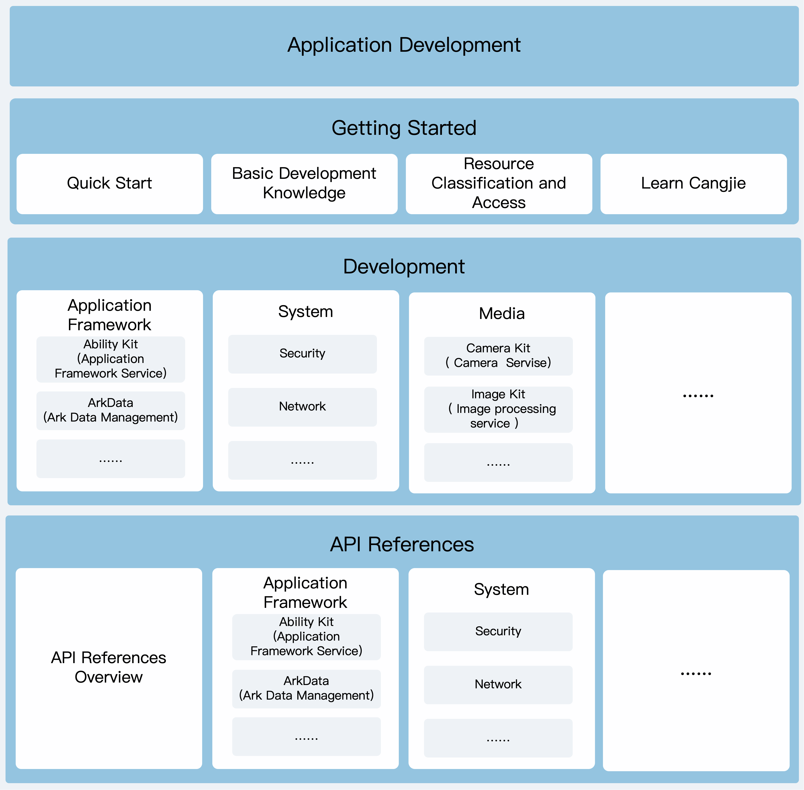

# OpenHarmony Cangjie Documentation

## Introduction

Welcome to the OpenHarmony Cangjie Documentation repository.

The Cangjie programming language is a general-purpose programming language designed for full-scenario application development. It balances development efficiency with runtime performance while providing an excellent programming experience.

This repository contains guides, API references, and other documentation related to developing OpenHarmony applications using the Cangjie programming language. We welcome you to read the documentation and participate in the OpenHarmony Cangjie Developer Documentation open-source project to collectively improve the developer documentation.

## Documentation Architecture

The overall architecture of OpenHarmony Cangjie documentation is illustrated below:

**Figure 1**: Documentation Architecture Diagram



As shown above, the application developer documentation primarily includes:

1. **[Getting Started](./en/application-dev/cj-start/README.md)**: Guides developers through building their first OpenHarmony application using Cangjie, creating their first hybrid application with Cangjie and ArkTS, and other simple "Hello World" examples. Additionally, this section introduces fundamental development knowledge to help developers gain a preliminary understanding of OpenHarmony application development.
2. **[Guides](./en/application-dev/README.md)**: This section explains relevant concepts, principles, mechanisms, and detailed development steps, covering:
   - **Application Framework**: Includes Ability Kit (application framework services), ArkData (Ark data management), ArkUI (Ark UI framework), window management, screen management, ArkWeb (Ark Web), Core File Kit (basic file services), IPC Kit (inter-process communication services), Localization Kit (localization development services), etc.
   - **System**: Includes security (application control access, cryptographic algorithm framework services, key management services, etc.), networking (short-range communication services, network services, cellular communication services, etc.), basic functionalities (process and thread communication, upload/download services, etc.), hardware (sensor services), and debugging/optimization (performance analysis services, application testing services, debugging commands, etc.).
   - **Media**: Includes camera services, image processing services, media file management services, etc.
   - **Graphics**: Includes Ark 2D graphics services.
   - **Application Services**: Includes location services.
3. **[API Reference](./en/application-dev/reference/README.md)**: Provides developers with functional descriptions of APIs, parameter and return value explanations, permission information, sample code, and more to help them understand and use OpenHarmony APIs in the Cangjie version.

## Documentation Directory

The overall directory structure of the OpenHarmony Cangjie Documentation repository is as follows:

```text
.
├── en                                   # English documentation directory (subdirectory structure mirrors zh-cn)
│   ├── application-dev                  # OpenHarmony-Cangjie application development documentation (guides, API references, etc.)
│   ├── CONTRIBUTING.md                  # Contribution guidelines
│   ├── COPYRIGHT                        # Copyright notice
│   ├── figures                          # Directory for images referenced in sibling files
│   ├── Overview-of-Cangjie-capabilities-in-OpenHarmony.md # Overview of Cangjie capabilities in OpenHarmony
│   └── README.md                        # Developer documentation overview
├── zh-cn                                # Chinese documentation directory
│   ├── application-dev
│   ├── CONTRIBUTING.md
│   ├── COPYRIGHT
│   ├── figures
│   ├── Overview-of-Cangjie-capabilities-in-OpenHarmony.md
│   └── README_zh.md
├── LICENSE                              # License file
├── OAT.xml                              # OAT rules file for repository OAT open-source checks
├── README.md                            # OpenHarmony-Cangjie documentation repository overview (English)
└── README_zh.md                         # OpenHarmony-Cangjie documentation repository overview (Chinese)
```

## Contributing

We welcome your contributions and encourage developers to participate in documentation feedback and contributions in various ways.

You can review existing documentation, make changes, report quality issues, or contribute original content. For details, please refer to [Contributing to Documentation](./en/CONTRIBUTING.md).

## License

The Cangjie developer documentation license can be found at [License](./LICENSE).

## Related Repositories

- [openharmony docs](https://gitcode.com/openharmony/docs/blob/master/README.md): OpenHarmony community documentation repository, containing application development documentation for OpenHarmony based on ArkTS language, as well as device development documentation and other developer resources.
- [cangjie_docs](https://gitcode.com/Cangjie/cangjie_docs/blob/main/README.md): Cangjie community documentation repository, storing Cangjie language syntax, command-line tools, and other Cangjie-related knowledge.
- [cangjie_runtime](https://gitcode.com/Cangjie/cangjie_runtime/blob/main/stdlib/doc/libs/summary_cjnative_EN.md): Cangjie runtime and Cangjie programming language standard library. You can view the standard library API reference here.
- [cangjie_stdx](https://gitcode.com/Cangjie/cangjie_stdx/blob/main/doc/summary_cjnative_EN.md): Cangjie programming language stdx extension module repository. You can view the extension library API reference in this repository.
